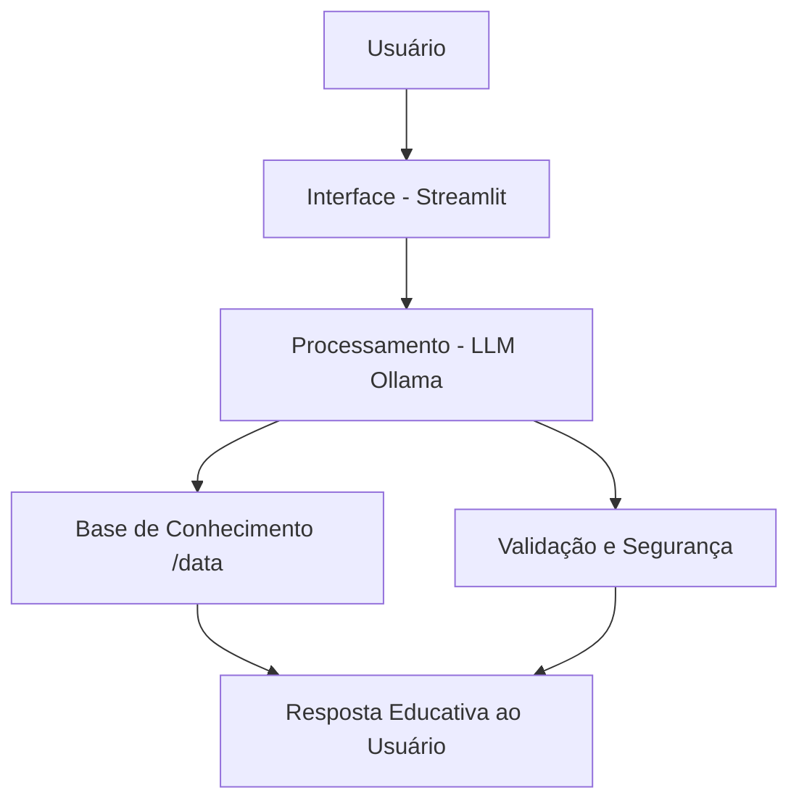

# 🤖 Agente Financeiro Inteligente: Amigo Investidor 🎓💰

Este repositório contém o protótipo e a documentação do **Amigo Investidor**, um agente de IA Generativa focado em educação financeira consultiva. O projeto foi desenvolvido para transformar a complexidade do mercado financeiro em um diálogo simples, seguro e personalizado.

---

## 🎯 Visão Geral

O **Amigo Investidor** não é apenas um chatbot; é um **mentor de bolso**. Ele utiliza os dados históricos e o perfil do usuário para ensinar conceitos financeiros na prática, antecipando dúvidas e gerando autonomia sem realizar recomendações diretas de ativos.

### Principais Diferenciais:
- **Ensino Baseado em Dados:** Utiliza o histórico real de transações para explicar conceitos.
- **Segurança (Anti-Alucinação):** Estrutura de prompts rígida para evitar recomendações de compra.
- **Linguagem Acessível:** Comunicação informal e didática, ideal para iniciantes.

---

## 📂 Estrutura do Repositório

Abaixo, você encontra o acesso rápido para cada etapa do desenvolvimento:

| Pasta / Arquivo | Descrição |
| :--- | :--- |
| [📁 `docs/01-documentacao-agente.md`](./docs/01-documentacao-agente.md) | **Documentação:** Caso de uso, arquitetura e tom de voz. |
| [📁 `docs/02-base-conhecimento.md`](./docs/02-base-conhecimento.md) | **Estratégia de Dados:** Como consumimos os arquivos CSV e JSON. |
| [📁 `docs/03-prompts.md`](./docs/03-prompts.md) | **Engenharia de Prompt:** System prompts e tratamento de casos limite. |
| [📁 `docs/04-metricas.md`](./docs/04-metricas.md) | **Avaliação:** Métricas de segurança e assertividade das respostas. |
| [📁 `docs/05-pitch.md`](./docs/05-pitch.md) | **Pitch:** Roteiro da apresentação da solução inovadora. |
| [📁 `src/app.py`](./src/app.py) | **Aplicação:** Código-fonte do protótipo em Streamlit. |
| [📁 `data/`](./data/) | **Dados Mockados:** Históricos de transações e perfis de investidor. |

---

## 🏗️ Arquitetura do Sistema

O fluxo de processamento garante que o agente nunca "alucine" recomendações, filtrando a entrada através de uma base de conhecimento educativa:



---

## 🛠️ Tecnologias Utilizadas

* **LLM:** [Ollama](https://ollama.ai/) (Modelos locais para garantir a privacidade dos dados).
* **Desenvolvimento:** Python & [Streamlit](https://streamlit.io/).
* **Orquestração:** Engenharia de Prompt (Prompt Engineering) especializada em educação financeira.
* **Multimídia:** [D-ID](https://www.d-id.com/) para criação do avatar e [NotebookLM](https://notebooklm.google.com/) para suporte didático e geração de slides.

---

## 🚀 Como Executar

### Pré-requisitos
Certifique-se de ter o **Python 3.9+** e o **Ollama** instalados em sua máquina.

### Passo a Passo

1. **Instalação das dependências:**
   ```bash
   pip install -r requirements.txt
   ```
   
2. **Rodar a Aplicação:**
    ```bash
    streamlit run src/app.py
    ```

    ## 🛡️ Compromisso com a Segurança

Conforme detalhado em nossa [documentação de métricas](./docs/04-metricas.md), o **Amigo Investidor** utiliza camadas de proteção rigorosas para garantir a confiabilidade e a ética das interações:

* **Bloqueio de Recomendações:** O agente é programado para nunca utilizar verbos no imperativo voltados à compra de ativos (ex: "compre", "invista em X"). O foco é estritamente educativo.
* **Privacidade:** Não solicita, não processa e não armazena dados sensíveis, como senhas, PINs ou chaves bancárias.
* **Integridade:** Prioriza a explicação da mecânica financeira e a educação do usuário, mantendo-se fiel ao papel de consultor didático e mentor.

---
**André Reis** | [GitHub: andrereis-ia](https://github.com/andrereistech)
